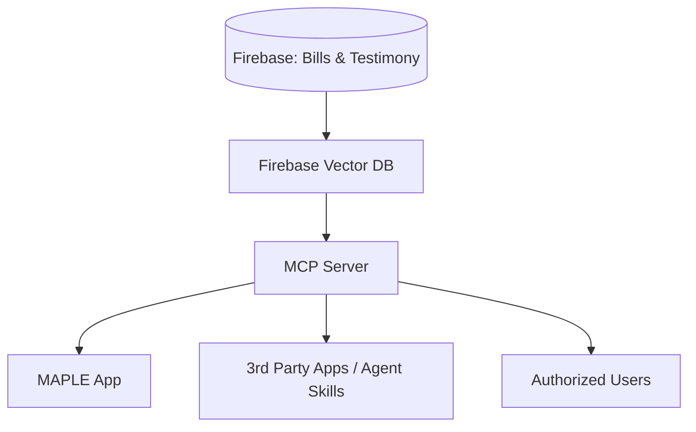

This document outlines the implementation for a Model Context Protocol (MCP) server enabling RAG operations over MAPLE data.

| Category | Description |
| :--- | :--- |
| **Goals** | • Inform and empower constituents for policy change • Increase engagement between legislature and constituents • Grow MAPLE usage by organizations, advocates, and journalists |
| **Jobs** | • "Tell me about bills that would..." (RAG over bills) • "Tell me what people are saying about..." (RAG over testimony) • "Tell me what other states are doing..." or "if it is true that..." (RAG over MAPLE + Web) |
| **Mechanisms** | • Deploy AI features on MAPLE • Enable 3rd parties (sites, Agent Skills) • Enable individual authorized users to leverage MAPLE data |

## Architecture

## Proposed Changes

### Firestore Vector Search Setup

We need to prepare Firestore to support vector queries.

#### [MODIFY] [firestore.indexes.json](file:///home/nes/Documents/HLS_BKC_Fellowship/maple/firestore.indexes.json)
- Add vector indexes for `bills` and `publishedTestimony` collections (dimension 768 for Vertex AI).

#### [NEW] `scripts/backfill-embeddings.ts`
- A script to iterate through all bills and testimony, generate embeddings using **Vertex AI**, and save them to a new `vector_embedding` field in Firestore.

#### [MODIFY] `llm/bill_on_document_created.py` (and similar triggers)
- Update existing LLM triggers to generate embeddings using Vertex AI whenever a new bill or testimony is added/updated.

---

### MCP Server Implementation

#### [NEW] `mcp-server/` (New Package)
Initialize a new Node.js package with the following structure:
- `package.json`: Include `@modelcontextprotocol/sdk`, `firebase-admin`, `@google-cloud/aiplatform`.
- `index.ts`: Main entry point implementing the MCP server with **SSE transport**.
- `tools.ts`: Implementation of RAG tools:
    - `search_bills`: Vector search on bills.
    - `search_testimony`: Vector search on testimony.
    - `get_bill_details`: Fetch full bill content.
    - `get_testimony_details`: Fetch testimony content.
- `auth.ts`: Middleware for **Hybrid Auth**:
    1.  Check for `Authorization: Bearer <token>`.
    2.  If token is a Firebase ID Token, verify via `admin.auth()`.
    3.  If token is an Agent Key, verify via lookup in `/agentKeys/{key}` Firestore collection.

---

### Deployment

#### [NEW] `mcp-server/Dockerfile`
- Containerize the MCP server for Cloud Run deployment.

#### [NEW] `infra/deploy-mcp.sh`
- Script to build and deploy the container to Google Cloud Run.

## Scalability & Cost Estimates

### Scalability Analysis
- **Cloud Run**: Scales from 0 to 1000+ instances. Initial users (5/day) will stay within the free tier. Scaling to 100+ users will trigger horizontal scaling with minimal latency impact.
- **Firestore Vector Search**: Managed by Google to scale transparently with document count and search volume.
- **Vertex AI**: High-throughput API that handles concurrent embedding requests effortlessly.

### Estimated Monthly Costs

| Component | Initial (25 queries/day) | Scale (500 queries/day) | Notes |
| :--- | :--- | :--- | :--- |
| **Vertex AI Embeddings** | ~$0.00 / month | ~$0.08 / month | $0.025 per 1M characters |
| **Firestore Reads** | $0.00 (Free Tier) | $0.00 (Free Tier) | Free up to 50k reads/day |
| **Cloud Run Compute** | $0.00 (Free Tier) | $0.00 (Free Tier) | Free tier: 180k vCPU-s/mo |
| **Network Egress** | ~$0.00 / month | ~$0.05 / month | Standard GCP rates |
| **Total Monthly Cost** | **~$0.00** | **~$0.15** | **Mostly covered by Free Tier** |

> [!NOTE]
> **One-time Backfill Cost**: ~$1.50 (assuming 10k documents and 50M characters).

## Verification Plan

### Automated Tests
- Unit tests for `mcp-server` tools using mocked Firestore and Vertex AI.
- Integration tests using the Firebase Emulator.

### Manual Verification
- Deploy to Cloud Run staging environment.
- Use the **MCP Inspector** or a custom script to connect via SSE.
- Verify that `search_bills` and `search_testimony` return relevant results for various queries using both Firebase Auth tokens and Agent Keys.

---

# Integration and Configuration

#### [MODIFY] [package.json](file:///home/nes/Documents/HLS_BKC_Fellowship/maple/package.json)
- Add a script to start the MCP server: `"mcp:start": "ts-node mcp-server/index.ts"`.

#### [NEW] `mcp-server/.env.example`
- Template for required environment variables: `FIREBASE_PROJECT_ID`, `OPENAI_API_KEY`, `MCP_API_KEY`.

## Verification Plan

### Automated Tests
- Unit tests for `mcp-server` tools using mocked Firestore and OpenAI.
- Integration tests using the Firebase Emulator (if it supports vector search, otherwise against a dev project).

### Manual Verification
- Start the MCP server locally.
- Connect it to Claude Desktop or use an MCP inspector tool.
- Verify that `search_bills` and `search_testimony` return relevant results for various queries.
