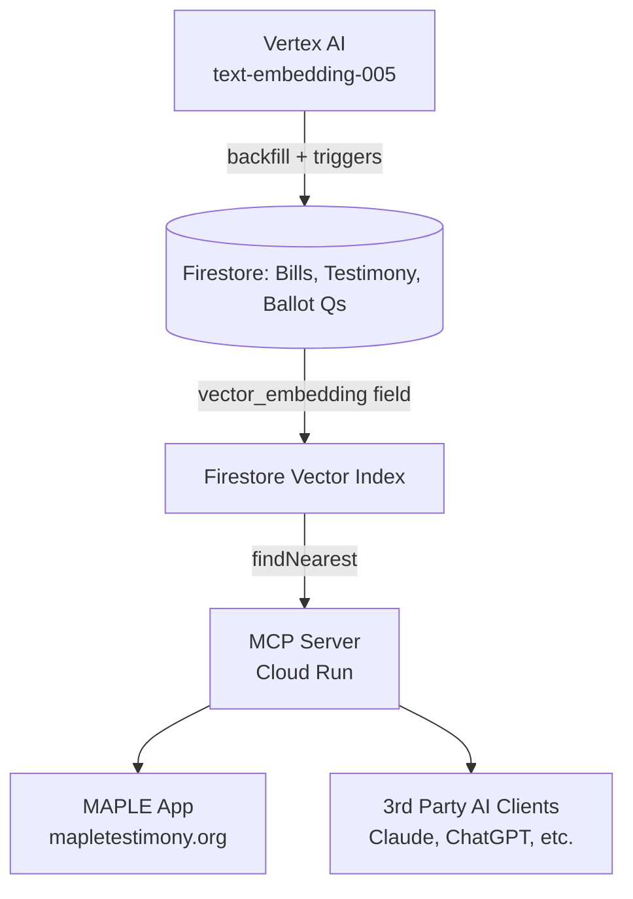
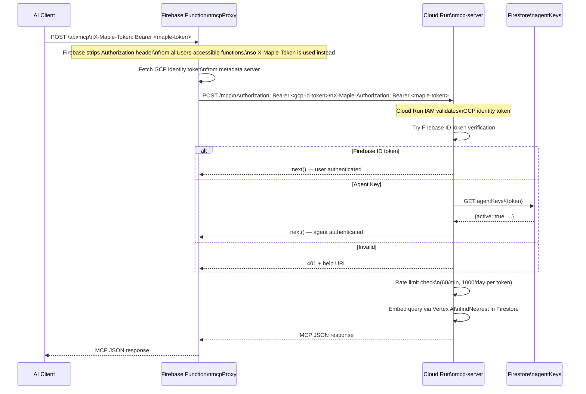

This document describes the implemented MCP server enabling AI-powered RAG over MAPLE legislative data.

| Category       | Description                                                                                                                                                                                                                                                                                                        |
| :------------- | :----------------------------------------------------------------------------------------------------------------------------------------------------------------------------------------------------------------------------------------------------------------------------------------------------------------- |
| **Goals**      | • Inform and empower constituents for policy change • Increase engagement between legislature and constituents • Grow MAPLE usage by organizations, advocates, and journalists                                                                                                                               |
| **Jobs**       | • "Tell me about bills that would..." (RAG over bills) • "Tell me what people are saying about..." (RAG over testimony) • "Tell me about the 2026 ballot questions regarding..." (RAG over ballot questions) |
| **Mechanisms** | • Deploy AI features on MAPLE • Enable 3rd parties (sites, Agent Skills) • Enable individual authorized users to leverage MAPLE data                                                                                                                                                                         |

## Architecture

### High-level data flow

### Auth flow

## Environments

- **DEV**: Project `digital-testimony-dev`. Cloud Run service and Firebase Function deployed and tested.
- **PROD**: Project `digital-testimony-prod`. Embeddings backfilled; deployment pending.

## What's implemented

### Firestore vector search

- **Vector indexes**: All required composite indexes in `firestore.indexes.json` — deployed to dev and prod.
- **Embedding model**: `text-embedding-005` (768 dimensions) via Vertex AI Predict API.
- **Backfill**: `scripts/firebase-admin/backfill-embeddings-parallel.ts` — parallel (concurrency=8) with exponential backoff. Run against both dev and prod.
- **Migration**: `scripts/firebase-admin/migrate-embeddings-to-vector.ts` — one-time migration of plain-array embeddings to Firestore `VectorValue` format (required for `findNearest`).
- **Continuous sync**: `functions/src/search/createVectorIndexer.ts` triggers on document write to keep embeddings current.

### MCP server (`mcp-server/`)

7 tools implemented in `tools.ts`:

| Tool | Description |
|:-----|:------------|
| `search_bills` | Vector search on bills. Filters: `legislationType`, `topic`, `committee`, `primarySponsor`, `court`, `includeFullText` |
| `search_testimony` | Vector search on testimony. Filters: `policyType`, `policyId`, `authorDisplayName`, `court` |
| `search_ballot_questions` | Vector search on ballot questions |
| `search_policies` | Unified search across bills + ballot questions, sorted by relevance |
| `list_topics` | Returns all valid AI-assigned topic tags by category |
| `list_committees` | Returns active committee names for use as filters |
| `list_sponsors` | Returns primary sponsor names for use as filters |

Auth (`auth.ts`): checks `X-Maple-Authorization` → `X-Maple-Token` → `Authorization` in that order. Accepts Firebase ID Token or agent key.

Rate limiting (`rateLimit.ts`): 60 req/min and 1,000 req/day per token, in-memory.

Transports: HTTP (`index-http.ts`) for Cloud Run; stdio (`index.ts`) for local use.

### Deployment

- **Cloud Run**: `mcp-server/Dockerfile` (two-stage build). Deployed to `digital-testimony-dev` with `max-instances=2`, `--no-allow-unauthenticated`.
- **Firebase Function proxy**: `functions/src/mcp/proxy.ts` (`mcpProxy`). Deployed to dev. Exposes `/api/mcp` via `firebase.json` hosting rewrite once hosting is deployed.
- **Billing budget**: $60/month alert on dev.

### User guide

New page at `/learn/ai-tools` (Learn nav menu) explaining setup for non-technical advocates, including Claude Desktop and ChatGPT instructions, example queries, and privacy notes.

## Remaining work (before prod deploy)

- [ ] Deploy Cloud Run + `mcpProxy` to prod
- [ ] CI/CD pipeline for Cloud Run image build and deploy on merge
- [ ] Hosting deploy needed to activate `/api/mcp` rewrite — nav link should not be publicly promoted until complete

## Cost estimates

| Component | 25 queries/day | 500 queries/day |
|:----------|:--------------|:----------------|
| Vertex AI Embeddings | ~$0.00 | ~$0.08/month |
| Firestore Reads | $0.00 (free tier) | $0.00 (free tier) |
| Cloud Run Compute | $0.00 (free tier) | $0.00 (free tier) |
| **Total** | **~$0.00** | **~$0.08/month** |

One-time backfill cost (dev + prod, ~27k docs): ~$3.
